# BDLab2024

## Собственный GUI менеджер для Базы данных

Позволяет хранить данные в виде базы данных.

## Как начать использоваться

### Установка

Запустите Relase.exe, чтобы начать работу

### Возможности

-  Создание БД
-  Открытие БП
-  Востановление БП из backup файла
-  Удаление БП

  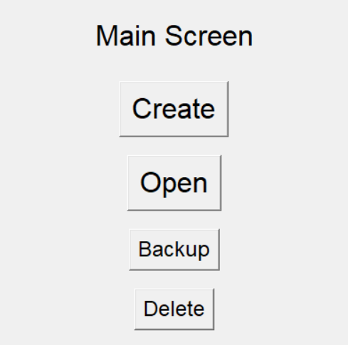

#### Создание БД

  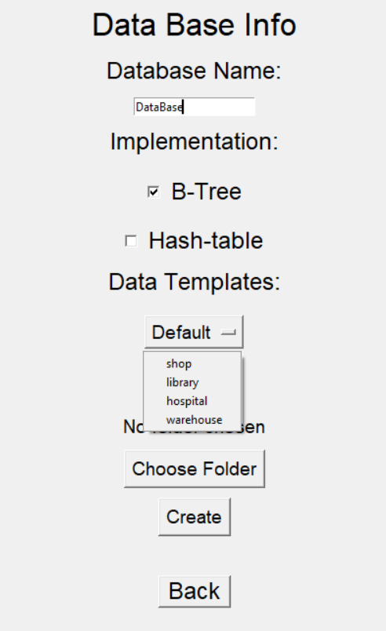

> Create
> Основные пункты для создание БД

-  Название БД
-  Выбор [реализации](#реализации) (Поддерживается B-Tree и HashTable)
-  Выбор шаблона данных
-  Выбор папки для сохранение БП

После успешного создания БД, появится папка с вабранным названием и внутри должен лежать файл **BDInfo.json**
**BDInfo.json** - содержит отновную информацию о БД, необходимую для коректной работы

#### Открытие БД

> Open

-  Выбираем созданную папку в качесте рабочей БП

#### Восстановление БП

  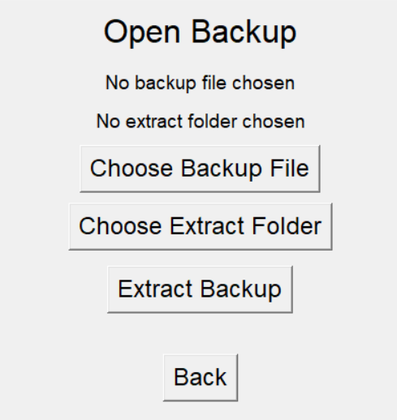

-  Backup
-  Для восстановления нужно выбрать

> \*название_бд\*\_backup.json - sourse файл
> Папку для сохранения

Note : Данные восстанавливаются при первом открытии папки

-  Delete

> Удаление выбранной БД

## Основной интерфейс

### Функционал

-  All info
-  Insert
-  Find
-  Edit
-  Delete
-  Backup
-  Export
-  All records
-  Back

#### All info

  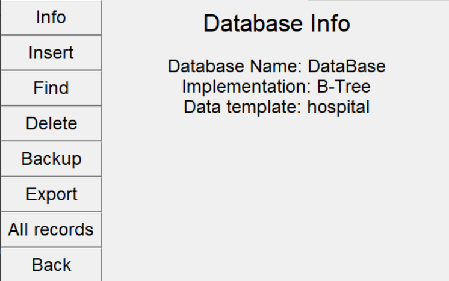

> Основная информация о БД, которую указывали при создании

#### Insert

  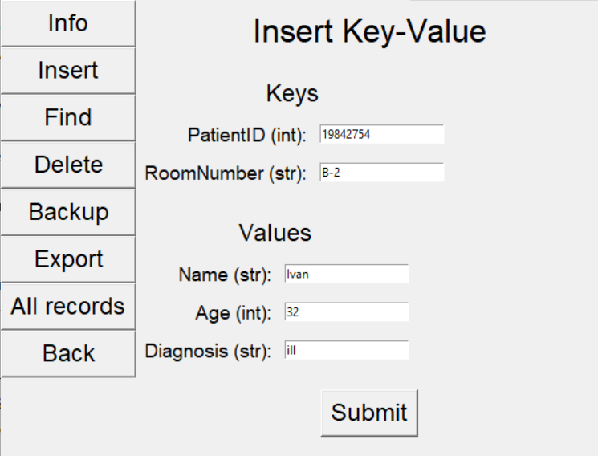

-  Вставка записи в БД. Submit - ввнести запись
-  Ключевые поля должны быть заполнены и как минимум 1 не ключевое
-  Проверка на нужный тип введенных данных

Note : в поле с типом 'str' можно ввести число

#### Find

  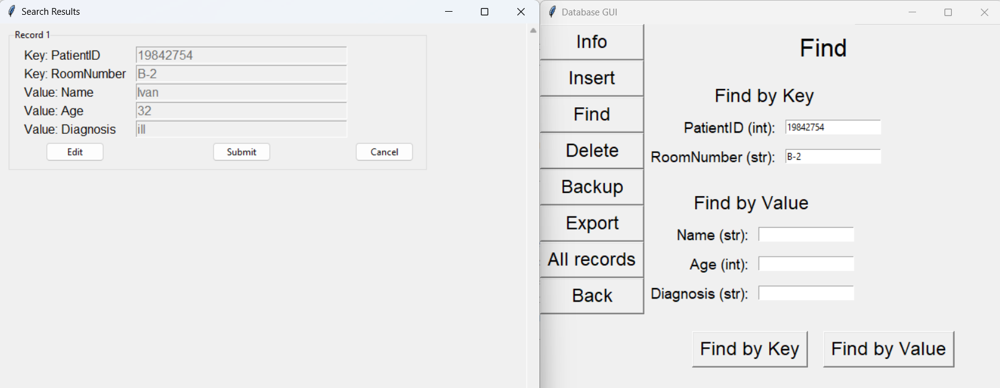

-  Можно искать как по ключам, так и по значениям

-  **Find by key**.
   Поиск по ключам - нужно ввести все поля для поиска. В отдельном окне выведит результаты

-  **Find by value**
   Поиск по значениям - выведит все записи, совпадающие по запросу - ввод всех полей не обязателен. В отдельном окне выводит все найденные записи

#### Edit

  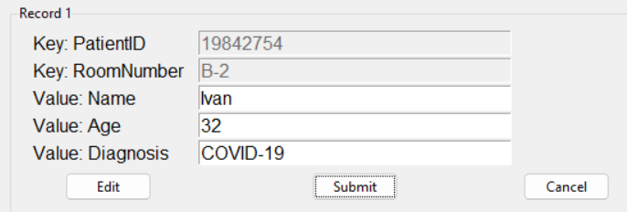

-  Чтобы редактировать, нужно найти нужную запить через Find любым способом

-  Когда нашли информацию, **edit** позволяет поменять данные. **cansel** - отменить редактирование
-  **submit** - внести изменения

Note : ключи менять нельзя

#### Delete

  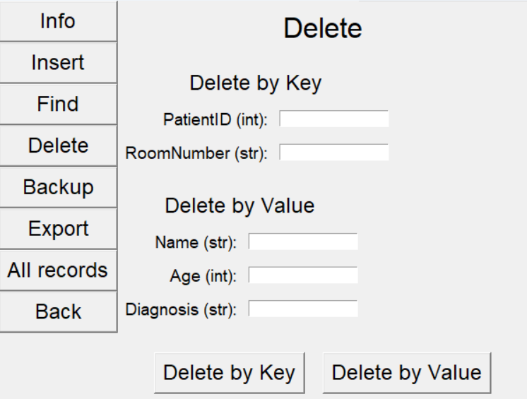

-  Можно удалять как по ключам, так и по значениям

-  **Find by key**.
   Удаление по ключам - нужно ввести все поля для поиска. В отдельном окне выведит результаты удаления

-  **Find by value**
   Удаление по значениям - выведит все записи, совпадающие по запросу - ввод всех полей не обязателен. В отдельном окне выводит все удаленные записи

#### Backup

### Make backup

  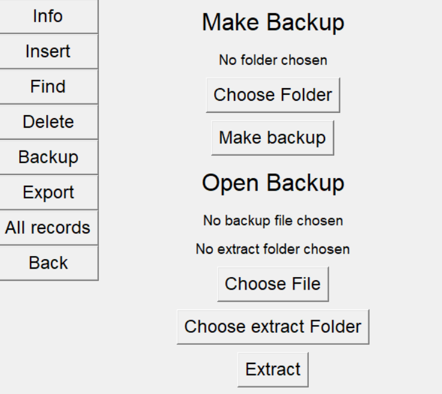

-  Создает backup файл текущей открытой БД

> Choose folder - выбор папки для сохранения
> Make backup - сделать backup

### Open backup

-  Функционал повторяет [Восстановление БП](#восстановление-бп)

### Export

  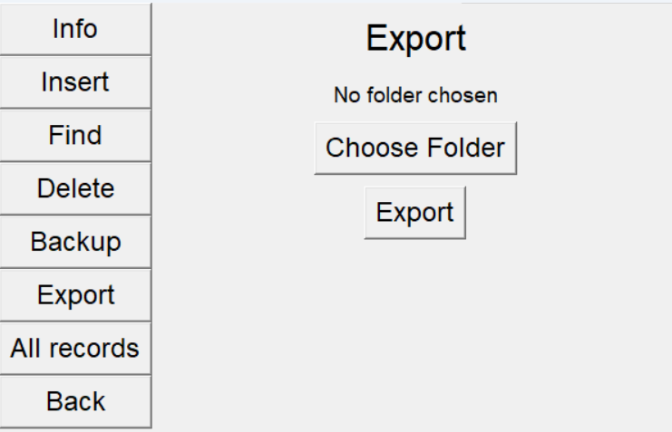

-  Создает **.xlsx** файл, содержащий все записи БД

  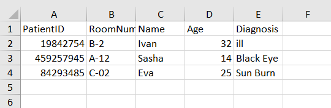

-  Choose folder - выбрать папку для сохранения
-  Export - сделать экспорт данных

### All records

  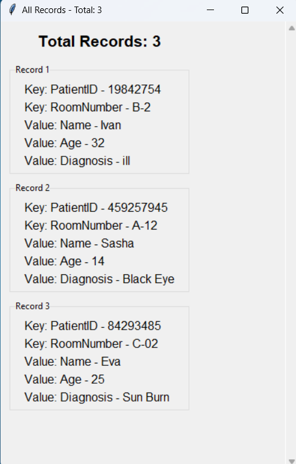

-  Выводит кол-во записей и сами записи в бд

### Back

-  Выводит в главное меню

## Реализации

### HashTable

Хранит данные в виде структуры данных Hash Table

#### Асимптотические сложности

| Операция      | В среднем | В худшем случае |
| ------------- | --------- | --------------- |
| Расход памяти | O(n)      | O(n)            |
| Поиск         | O(1)      | O(n)            |
| Вставка       | O(1)      | O(n)            |
| Удаление      | O(1)      | O(n)            |

#### Примечания

-  [CityHash](https://github.com/google/cityhash) - используемая функция для получения hash
-  Максимальное кол-во записей (По чему берется модуль hash) - 210
-  Не работает с кириллицой

### B-Tree

Хранит данные в виде структуры данных B-Tree

#### Асимптотические сложности

| Операция      | В среднем | В худшем случае |
| ------------- | --------- | --------------- |
| Расход памяти | O(n)      | O(n)            |
| Поиск         | O(log n)  | O(log n)        |
| Вставка       | O(log n)  | O(log n)        |
| Удаление      | O(log n)  | O(log n)        |

#### Примечания

-  Параметр t для дерева равен 3

-  bruh
